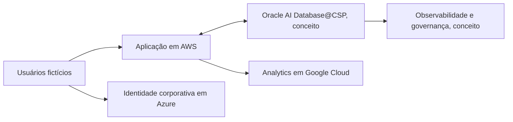

# Diagrama conceitual

```mermaid
flowchart LR
  U[Usuários fictícios] --> A[Aplicação em AWS]
  U --> Z[Identidade corporativa em Azure]
  A <--> O[Oracle AI Database@CSP, conceito]
  A --> G[Analytics em Google Cloud]
  O --> M[Observabilidade e governança, conceito]
```

O diagrama é didático. Ele não representa serviços implantados nem conexão entre nuvens.